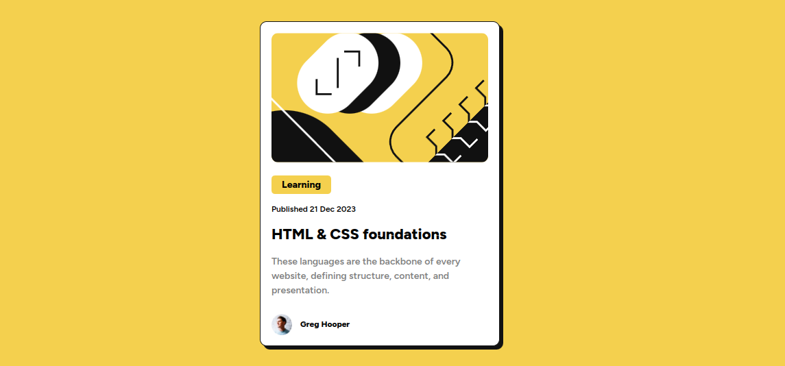

# Frontend Mentor - Blog preview card solution

This is a solution to the [Blog preview card challenge on Frontend Mentor](https://www.frontendmentor.io/challenges/blog-preview-card-ckPaj01IcS). Frontend Mentor challenges help you improve your coding skills by building realistic projects.

## Table of contents

- [Overview](#overview)
  - [Screenshot](#screenshot)
  - [Links](#links)
- [My process](#my-process)
  - [Built with](#built-with)
- [Author](#author)

## Overview

### Screenshot

### Links

- Solution URL: [Solution](https://www.frontendmentor.io/solutions/blog-preview-card-component-solution-MLBrSBV4b_)
- Live Site URL: [Live site](https://precious-dodol-4a2dd2.netlify.app)

## My process

### Built with

- HTML
- CSS
- Flexbox

## Author

- Frontend Mentor - [@ignbmd](https://www.frontendmentor.io/profile/yourusername)
- Twitter - [@ignbmd](https://www.twitter.com/ignbmd)
